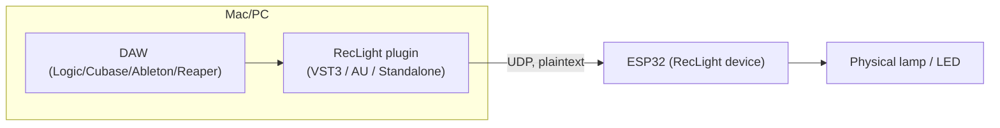

# RecLight

> **Copyright © 2026 Hauke Steinbach. All rights reserved.**
>
> This code is published **for inspection only** — so that anyone considering
> installing RecLight can read it and check what it does. **It is not open
> source.** No copying, redistribution, modification, reuse of any part, or
> commercial use without written permission.
>
> **It may not be used to train, fine-tune or evaluate AI or machine learning
> models**, or included in any dataset assembled for that purpose — by a person
> or by an automated process. Reading this code grants no licence to reproduce
> it through the output of such a system.
>
> Permission: mail@haukesteinbach.de — full terms in [LICENSE](LICENSE).

**RecLight is a wireless "on air" lamp for a home or project studio.** A small
Wi-Fi controller switches a lamp on by itself whenever your DAW starts
recording, driven by a plug-in you put on your master track.

This repository holds the complete source code of everything that runs on your
machine and on the device — the plug-in, the controller firmware, and the
scripts that build the installers. It is public so that anyone can check what
the software actually does before installing it.

## Downloads

Direct links, always pointing at the newest release:

| | Download | Contains |
|---|---|---|
| **macOS** | [RecLight-macOS.pkg](../../releases/latest/download/RecLight-macOS.pkg) | VST3, Audio Unit and the standalone app |
| **Windows** | [RecLight-Windows-Setup.exe](../../releases/latest/download/RecLight-Windows-Setup.exe) | VST3 and the standalone app |
| **Controller** | [RecLight-Firmware.bin](../../releases/latest/download/RecLight-Firmware.bin) | Firmware image for the RecLight device |
| **Checksums** | [SHA256SUMS.txt](../../releases/latest/download/SHA256SUMS.txt) | Verify any of the above |

**[All releases and their notes →](../../releases)**

Every file is built by GitHub itself from the source at its tag, by
[the release workflow](.github/workflows/release.yml). The build log is public
under **Actions**, so a download can be traced back to the code it came from —
nothing is uploaded from a private machine. The filenames stay the same from
release to release, which is what keeps the links above working; the version is
in the release title and in the installer itself.

The installers are not signed with a paid developer certificate, so macOS shows
an "unidentified developer" warning the first time. Right-click the installer
and choose **Open** to proceed.

## What the software does — and doesn't

If you are installing an audio plug-in that talks to your network, this is the
part worth reading.

**The plug-in** sits on a track in your DAW and does exactly two things: it
asks the DAW whether the transport is recording or playing, and it sends that
answer to your RecLight controller as a short message on your local network
(`REC:1`, `REC:0`, and the like — see [the protocol table below](#network-protocol)).
It does not touch your audio: the signal passes through untouched, which you
can see in `processBlock()` in
[Source/PluginProcessor.cpp](Source/PluginProcessor.cpp) — the buffer is never
read or written.

**What it stores**, on your machine only, in
`~/Library/Application Support/RecLight/`: the controller's address on your
network, plus the Wi-Fi name and password *if* you chose to set the device up
from the plug-in rather than from the device's own setup page.

**What it never does:**

- No internet connection. The plug-in speaks only to your RecLight controller,
  on your own network. There is no server, no account, no licence check, no
  update check.
- No analytics, telemetry, crash reporting or usage tracking of any kind.
- No audio recording, no audio analysis, no audio leaving your machine.
- No access to your projects, files, microphone, or anything outside its own
  settings file.

You do not have to take any of that on trust. The whole plug-in is four files
in [Source/](Source) — about 1,300 lines — and the only network calls in it are
the `writeDatagram()` sends in
[PluginProcessor.cpp](Source/PluginProcessor.cpp). The controller firmware is
in [OnAirLinkFirmware/](OnAirLinkFirmware).

## Licence

**Copyright © 2026 Hauke Steinbach. All rights reserved.** See [LICENSE](LICENSE).

This code is published so that anyone considering installing RecLight can read
it and check what it does. That is the only reason it is here. **It is not open
source.** You may read it, and build it unmodified for your own use on your own
hardware; anything beyond that — copying, redistributing, modifying, reusing
parts of it, or using it commercially — needs written permission.

**It may not be used to train machine learning models**, or included in any
dataset assembled for that purpose, by a person or by an automated process.
Reading this code grants no licence to reproduce it through the output of such
a system.

Permission for any of the above: mail@haukesteinbach.de

### Third-party code

| Component | Where | Licence |
|---|---|---|
| ESP-IDF | fetched by the firmware build | Apache 2.0 (Espressif) |
| JUCE 8 | fetched by the plug-in build, not stored here | AGPL v3 **or** a commercial JUCE licence |
| esptool | bundled in the internal flasher tool only | GPL v2 |

These carry their own terms, which take precedence for those components. The
controller firmware uses none of them beyond ESP-IDF, and contains no
copyleft-licensed code.

## Building it yourself

If you would rather not run a downloaded binary at all, you can build the same
thing from this source:

```
cmake -B build -DCMAKE_BUILD_TYPE=Release
cmake --build build --config Release
```

JUCE (the audio framework) is fetched automatically. That is the identical
command the release workflow runs.

---

The rest of this document is the technical description, written for a security
review rather than for end users: architecture, the exact network protocol,
what is stored where, and an honest list of the design's limitations.

## Components

| Component | Location | Language / Stack | Runs on |
|---|---|---|---|
| Audio plugin (VST3 / AU / Standalone) | [Source/](Source) | C++ / JUCE 8.0.14 | macOS, Windows (VST3 + Standalone only; AU is Apple-only) |
| ESP firmware | [OnAirLinkFirmware/](OnAirLinkFirmware) | ESP-IDF / C++, ESP32-C3 | ESP32-C3, speaks the RecLight UDP protocol over the network |

There is no Bluetooth/BLE component anywhere in the project: all communication
between the plugin and the device happens over Wi-Fi UDP (see below).

## Architecture



## Network protocol

All device communication is **plaintext UDP with no authentication and no
encryption**.

| Port | Direction | Purpose | Payload examples |
|---|---|---|---|
| `4300`–`4304` (`STUDIO_PORT_BASE` + studio − 1) | Plugin → ESP | Transport/lamp control | `REC:1`, `REC:0`, `PLAY:1`, `BRIGHT:<5-100>`, `MODE:<0\|1>` |
| `4211` (`ANNOUNCE_PORT`) | ESP → Plugin (broadcast) | Device auto-discovery | `ONAIR_IP:<ip>` |
| `4212` (`CONFIG_PORT`) | Plugin → ESP | Wi-Fi provisioning / reset / lamp settings | `CFG:1\nSSID:<ssid>\nPASS:<pass>`, `RESET`, `PING`, `BRIGHT:<n>`, `BRIGHT?`, `MODE:<n>`, `MODE?`, `STUDIO:<0-5>`, `STUDIO?` |

The setup portal is styled after the studio site (haukesteinbach.de, Jakob's
design system in `assets/css/steinbach.css`): black ground, headline grey, the
single `#E94560` accent as a solid block, Archivo Black caps, mono eyebrows and
the amplitude tick rail. **The site's webfonts are not embedded** — they would
cost ~68 KB of an app partition with ~130 KB to spare, so the page uses the
fallback stacks the site's own stylesheet declares (Arial Black / Avenir Next /
`ui-monospace`), all present on the macOS and iOS devices setup runs on. The
slider and radios are drawn in CSS rather than tinted with `accent-color`,
which only recolours the platform widget and still reads as macOS.

The device's HTTP setup portal also exposes `GET /brightness?v=<n>`,
`GET /mode?v=<0|1>` and a read-only `GET /status` (JSON) on port 80, with the
same lack of authentication as everything else below.

During first-time setup, the ESP32 opens an **open (unencrypted) Wi-Fi access point**
named `"RecLight Setup <code>"`, where the code is derived from the device's
MAC address (no password — see
[OnAirLinkFirmware/main/main.cpp](OnAirLinkFirmware/main/main.cpp)). The AP is
no longer permanent: once the device has joined the studio network it
deauthenticates its clients and shuts the AP down (see *End-user setup flow*
below), so the open network only exists during setup and as a rescue path.
Studio
Wi-Fi credentials (`CFG:1\nSSID:...\nPASS:...`) are sent to it over that open AP as
a **plaintext UDP datagram**, and the config port (`4212`) accepts and applies
`CFG:1` / `RESET` commands from **any client that can reach it**, with no shared
secret, token or pairing step. The same applies to the control port (`4300`) once
the device has joined the studio network: any device on that network can send
`REC:1` / `REC:0` datagrams and toggle the lamp, or replay/spoof state.

## Data storage

| Data | Where | Format |
|---|---|---|
| Studio Wi-Fi SSID/password, last known device IP | `~/Library/Application Support/RecLight/RecLight.settings` (macOS, `juce::PropertiesFile`) | Plaintext XML, no encryption key configured |
| Studio Wi-Fi SSID/password | ESP32 NVS flash, namespace `reclight` (`Preferences` library) | Plaintext strings; NVS encryption is not enabled in the firmware/partition config |
| "These credentials have worked once" flag | ESP32 NVS flash, key `joined` | Single byte; gates the abandoned-setup reset described below |
| Studio number (1–5, or 0 for ALL) | ESP32 NVS flash, key `studio`; mirrored in the host settings file | Integer; selects the control port |
| Lamp brightness (percent), recording lamp mode | ESP32 NVS flash, keys `bright` / `lampmode`; mirrored in the host settings file | Integers, written at most once per 2 s of activity |

## Permissions / entitlements requested (macOS plugin)

Declared in [CMakeLists.txt](CMakeLists.txt) via `juce_add_plugin`:

- `LOCAL_NETWORK_PERMISSION_ENABLED` — "RecLight sends and receives UDP messages on your local WiFi network to find and control the RecLight ESP device."

No Bluetooth entitlement/permission is requested; the plugin does not link
CoreBluetooth or any other Bluetooth framework.

## Build, distribution & code signing

- Plugin formats: VST3 + AU + Standalone on macOS, VST3 + Standalone on Windows
  (built against JUCE 8.0.14, fetched via CMake `FetchContent` if no local checkout
  is present).
- macOS installer: [installer/build_installer.sh](installer/build_installer.sh) builds
  a `.pkg` via `pkgbuild`/`productbuild`. **No `codesign`/notarization step is present
  in the script** — the produced package and the binaries inside it are unsigned.
  Gatekeeper will show an "unidentified developer" warning on install.
- Windows installer: [installer/windows/RecLight.iss](installer/windows/RecLight.iss)
  (Inno Setup, built via [.github/workflows/windows-build.yml](.github/workflows/windows-build.yml)).
  No Authenticode signing step either.
- macOS installer is also built in CI via [.github/workflows/macos-build.yml](.github/workflows/macos-build.yml)
  (runs the same `build_installer.sh` script on a `macos-latest` runner).
- ESP32 firmware is built in CI via [.github/workflows/firmware-build.yml](.github/workflows/firmware-build.yml),
  using the official `espressif/idf` Docker image, so contributors don't need a
  local ESP-IDF install just to get a flashable image (see Downloads above).
- No auto-update / OTA mechanism exists for either the plugin or the ESP firmware;
  updates are manual reinstalls / reflashes.

### Flashing controllers (internal production tool)

`OnAirLinkFirmware/tools/build_flasher_app.sh --install` produces
**RecLight Flasher.app** and installs it to `/Applications`. The bundle carries
its own Python, Tcl/Tk, esptool *and* a copy of the merged firmware image, so
the machine flashing boards needs neither Homebrew nor ESP-IDF nor a checkout
of this repository — only the build machine does. Rebuild the app whenever the
firmware image changes; the image is baked in at build time.

Alternatives without the app: `OnAirLinkFirmware/tools/FlashRecLight.command`
(same GUI, run from source) or `OnAirLinkFirmware/flash_esp.sh` in a terminal.
The flasher is a production tool and is deliberately **not** part of the
customer installer.

## Known limitation: Audio Unit (Logic Pro / GarageBand) transport detection

The classic AU host-callback API (`kAudioUnitProperty_HostCallbacks`) has no
concept of "is recording" — it only exposes `isPlaying`. JUCE's AU wrapper never
calls `PositionInfo::setIsRecording()`. [PluginProcessor.cpp](Source/PluginProcessor.cpp)
therefore treats "transport playing" as "recording" specifically when
`wrapperType == wrapperType_AudioUnit`, since that's the closest signal available
under AU. VST3 hosts (Cubase, Ableton, Reaper) report real recording state and are
unaffected.

## End-user setup flow

1. Install the plugin.
2. Power the device on. Its display shows **Step 1**.
3. Join the device's `RecLight Setup <code>` Wi-Fi network from your Mac. The
   four-character code is on the device's display, so two factory-fresh units
   standing side by side are still told apart. The setup page opens
   by itself (captive portal); if it doesn't, open `http://192.168.4.1/`.
4. Enter your studio Wi-Fi name and password, and submit.
5. The device restarts, joins your studio network — and then **deliberately
   disconnects your Mac from `RecLight Setup` and shuts that network down**.
   Your Mac returns to its usual Wi-Fi on its own. The display shows **READY**.
6. Rescan plug-ins in your DAW, add RecLight to the master track, and go.

Lamp brightness and the recording lamp mode can be set on the setup page and
in the plugin UI; the device remembers both, so they survive a reboot with no
plugin attached.

### Studios

Up to five RecLight devices can share one network. Each studio has its own
control port — studio 1 is `4300`, studio 2 is `4301`, and so on — so the lamp
in one room does not follow the transport in another. The number is chosen
during setup and can be changed later from the plug-in; the device stores it
and announces it, so a plug-in only manages the device with the same number.

**Studio `ALL`** is the exception: a device set to ALL listens on every
studio's control port, so its lamp says "someone is recording" rather than
naming a room. That is what a lamp in a hallway or outside the kitchen wants.
A plug-in set to ALL mirrors this and sends its transport to every studio, so
one DAW can drive every lamp in the building.

The **config port `4212` is the same for every studio**, deliberately: it is
the port that changes a device's studio, and it would be useless if pointing a
plug-in at the wrong number made the device unreachable by the very command
that fixes it.

### Lamp behaviour

| State | Lamp |
|---|---|
| Waiting for a network (setup, or a lost connection) | slow eased breath between 6 % and 50 % over 6 s, capped at 50 % so it doesn't wash out the OLED next to it |
| Recording, mode **Classic** | blinks once a second at the configured brightness |
| Recording, mode **Pulse** | brightness eases between 28 % and 100 % of the configured brightness over 2.2 s, never reaching off |
| Playing | solid |
| Just stopped | fast blink for 10 s |
| Idle, connected | off |

No fade ever reaches black or stands still. Pulse stays lit because this is a
tally light: someone glancing in from the corridor has to read "recording" at
any instant, which a blink cannot promise. The setup breath stays lit and
moving for a plainer reason — a lamp that sits at zero for a moment reads as a
lamp that is off, and gamma correction makes a nominally brief pause at the
bottom look like a couple of seconds of nothing.

All fades are gamma-corrected and eased with smootherstep, so it is the
*perceived* brightness that moves smoothly rather than the duty cycle.

### Why the device kicks you off its own network

The setup AP used to stay up forever. That left the setup machine associated
to an open access point with no internet and no route to the studio LAN, so
the plugin couldn't reach anything and the device looked broken — the single
most common cause of "it doesn't work" reports. The firmware now treats the
setup network as a temporary state:

| Situation | Setup AP |
|---|---|
| Never configured | up — this is first-time setup |
| Configured, studio Wi-Fi joined | kept `AP_SHUTDOWN_GRACE_MS` (12 s) so the confirmation page can load, then clients are deauthenticated and the AP goes down |
| Configured, studio Wi-Fi unreachable for `AP_RESCUE_AFTER_MS` (60 s) | brought back up, so the device can be re-provisioned without a factory reset |

Both the portal and the OLED say so before it happens ("Leaving setup — Mac
returns to your WiFi"), so the disconnect reads as progress rather than
failure. A saved-but-never-joined network (typically a mistyped password, or a
5 GHz-only network) is now reported as such on the portal and the display
instead of silently showing "configured".

### Abandoned setup

Credentials that have never once produced a connection are **provisional**. If
setup isn't completed within `SETUP_ABORT_TIMEOUT_MS` (5 minutes), the device
factory-resets itself and comes back unconfigured.

This targets the half-configured state: a device holding a mistyped password
retries it forever and reports "configured" in the portal, quietly
contradicting the person trying to set it up again. Nothing about an
incomplete setup is worth keeping, so it keeps nothing — the reset clears the
lamp settings along with the credentials.

The moment a join first succeeds, the credentials are marked proven (NVS key
`joined`) and the watchdog stands down permanently. **A device that has been
set up never wipes itself**, no matter how long its network stays away — which
is the whole reason the flag is persisted rather than inferred from the
current connection state.

Holding the device's BOOT button for 5 s still performs a full factory reset.

## Security summary (for reviewers)

- All device control/provisioning traffic is unauthenticated, unencrypted UDP on a
  local network (ports `4211`/`4212`/`4300`).
- Wi-Fi provisioning happens over an **open** Wi-Fi AP (`RecLight Setup`),
  which is now shut down again once the device has joined the studio network
  (and re-opened only when that network is unreachable for 60 s).
- Wi-Fi credentials are stored in plaintext on both the host (JUCE `PropertiesFile`
  XML) and the device (ESP32 NVS).
- Installers (macOS `.pkg`, Windows Inno Setup) are unsigned/unnotarized.
- No firmware/plugin auto-update or integrity-verification mechanism.
- No Bluetooth/BLE anywhere in the project (removed entirely).

These are architectural trade-offs of a hobby/studio device intended for trusted
local networks, not internet-facing use — flagged here explicitly for anyone
assessing the project's threat model.
